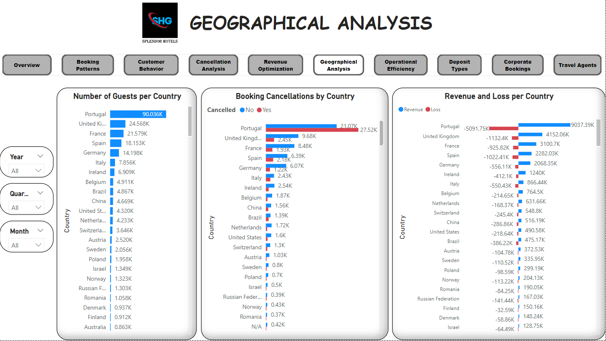

# Analyzing Booking Data for Splendor Hotel Groups
### Project Overview:
The task involves a thorough analysis of a comprehensive dataset, featuring intricate details of bookings, guest demographics, distribution channels, and financial metrics. By applying analytical prowess, we aim to extract meaningful insights that will not only inform operational improvements but also contribute to the overall success of SHG in delivering unparalleled hospitality.

### Objectives of the Analysis
**Booking Patterns:**
- What is the trend in booking patterns over time, and are there specific seasons or months with increased booking activity?
- How does lead time vary across different booking channels, and is there a correlation between lead time and customer type?

**Customer Behavior Analysis:**
- Which distribution channels contribute the most to bookings, and how does the average daily rate (ADR) differ across these channels?
- Can we identify any patterns in the distribution of guests based on their country of origin, and how does this impact revenue?

**Cancellation Analysis:**
- What factors are most strongly correlated with cancellations, and can we predict potential cancellations based on certain variables?
- How does the revenue loss from cancellations compare across different customer segments and distribution channels?

**Revenue Optimization:**
- What is the overall revenue trend, and are there specific customer segments or countries contributing significantly to revenue?
- Can we identify optimal pricing strategies based on the Average Daily Rate (ADR) for different customer types and distribution channels?

**Geographical Analysis:**
- How does the distribution of guests vary across different countries, and are there specific countries that should be targeted for marketing efforts?
- Is there a correlation between the country of origin and the likelihood of cancellations or extended stays?

**Operational Efficiency:**
- What is the average length of stay for guests, and how does it differ based on booking channels or customer types?
- Are there patterns in check-out dates that can inform staffing and resource allocation strategies?

**Impact of Deposit Types:**
- How does the presence or absence of a deposit impact the likelihood of cancellations and revenue generation?
- Can we identify any patterns in the use of deposit types across different customer segments?

**Analysis of Corporate Bookings:**
- What is the proportion of corporate bookings, and how does their Average Daily Rate (ADR) compare to other customer types?
- Are there specific trends or patterns related to corporate bookings that can inform business strategies?

**Time-to-Event Analysis:**
- How does the time between booking and arrival date (lead time) affect revenue and the likelihood of cancellations?
- Are there specific lead time ranges that are associated with higher customer satisfaction or revenue?

**Comparison of Online and Offline Travel Agents:**
- What is the revenue contribution of online travel agents compared to offline travel agents?
- How do cancellation rates and revenue vary between bookings made through online and offline travel agents?

#### Data Dictionary:
- **Booking ID:** Unique identifier for each booking.
- **Hotel:** Type or name of the hotel within the Splendor Hotel Group.
- **Booking Date:** Date when the booking was made.
- **Arrival Date:** Date when the guests are scheduled to arrive.
- **Lead Time:** Number of days between the booking date and arrival date.
- **Nights:** Number of nights the guests are booked to stay.
- **Guests:** Number of guests included in the booking.
- **Distribution Channel:** The channel through which the booking was made (e.g., Direct, Online Travel Agent, Offline Travel Agent).
- **Customer Type:** Type of customer making the booking (e.g., Transient, Corporate).
- **Country:** Country of origin of the guests.
- **Deposit Type:** Whether a deposit was made for the booking (e.g., No Deposit, Deposit).
- **Avg Daily Rate:** Average daily rate for the booking.
- **Status:** Status of the booking (e.g., Check-Out, Canceled).
- **Status Update:** Date of the last status update for the booking.
- **Canceled (0/1):** Binary indicator of whether the booking was canceled (1 if canceled, 0 if not canceled).
- **Revenue:** Revenue generated from the booking.
- **Revenue Loss:** Loss in revenue if the booking was canceled (negative value if the booking was canceled)

# Dashboards
An interractive dashboard was created using Power BI desktop to answer he above questions and derive insights using the data. Each dashboard contains filters to enable selective exploration of the results displayed. The dashboards are as shown below:

### Overview

### Booking Patterns

### Customer Behavior

### Cancellation Analysis

### Revenue Optimization

### Geographical Analysis

### Operational Efficiency

### Impact of Deposit Types

### Analysis of Corporate Bookings

### Comparison of Online and Offline Travel Agents

